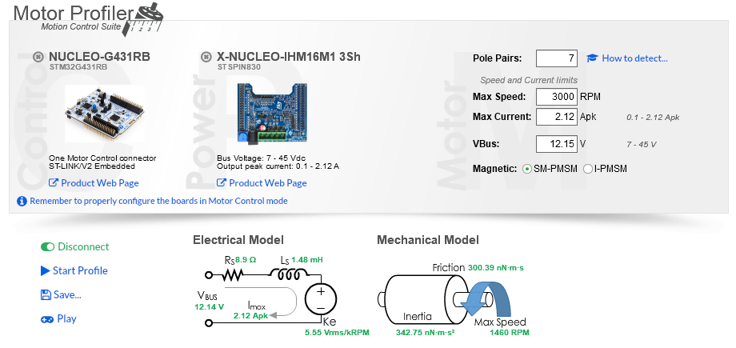

# Source
* Purchase Link: [Aliexpress](https://www.aliexpress.us/item/2255800199328769.html?spm=a2g0o.order_detail.0.0.2959f19c1YVG9L&gatewayAdapt=glo2usa&_randl_shipto=US)
* Cost: $15.52 for 2x as of 26-Oct-2022

# Specs

| Spec | Value |
| ---- | --- |
| Part Number | GM2208-80 |
| Magnetic Configuration | 12N14P |
| Coil Wire Diameter |  |
| Coil Turns | 70? |
| Motor Diameter | 28 mm |
| Motor Thickness | XX mm |
| Shaft Diameter | N/A |
| Winding Resistance | XX Ω |
| KV | 80 RPM/V |
| Weight | 39 gm |

(Turn count from [another supplier's](https://www.aliexpress.us/item/2251801357113153.html) similar motor )

# Drawing

(Drawing from [another supplier's](https://www.aliexpress.us/item/2251801357113153.html) similar motor )

# ST Motor Profiler Test Results

# Hand Measured

To-Do

Phase-phase resistance measured with a DMM was XX Ω

> **Note**
>
> Based on hand mesaurement, it looks like ST reports the single phase resistance, while the motor spec lists the phase-phase resistance.

# Characterization Base

## Files

* [STL](Base-2208.STL)
* [SolidWorks](Base-2208.SLDPRT)
* [Prusa Slicer Project](Base-2208.3mf)
* [Ender3 Pro G-Code](Base-2208_1h20m_0.20mm_205C_PLA_ENDER3.gcode)
