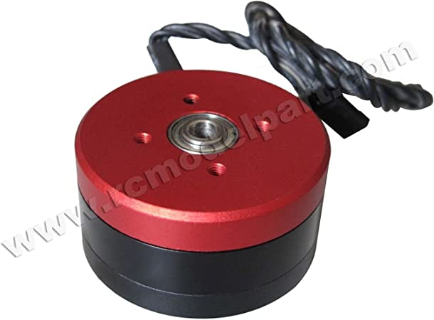
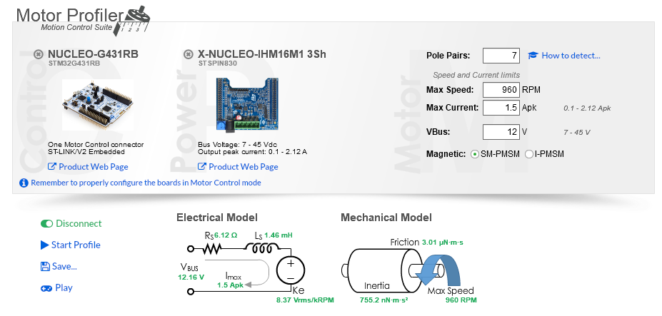

# Source
* Purchase Link: [Amazon](https://www.amazon.com/gp/product/B00YEGVOII/ref=ppx_yo_dt_b_search_asin_title)
* Cost: $35 as of 10-Oct-2022

# Specs

| Spec | Value |
| ---- | --- |
| Part Number | BGM4108-150HS |
| Magnetic Configuration | 24N22P |
| Coil Wire Diameter | 0.21mm |
| Coil Turns | 150 |
| Motor Diameter | 46 mm |
| Motor Thickness | 25 mm |
| Shaft Diameter | Hollow 5.0 mm |
| Winding Resistance |12.0 Ω |
| KV | 80 RPM/V |
| Weight | 93 gm |

# ST Motor Profiler Test Results

# Hand Measured

Phase-phase resistance measured with a DMM was 12.4 Ω

> **Note**
>
> Based on hand mesaurement, it looks like ST reports the single phase resistance, while the motor spec lists the phase-phase resistance.

# Characterization Base

## Files

* [STL](4108-150hs/4108-base.STL)
* [Pruse Slicer Project](4108-150hs/4108-base.3mf)
