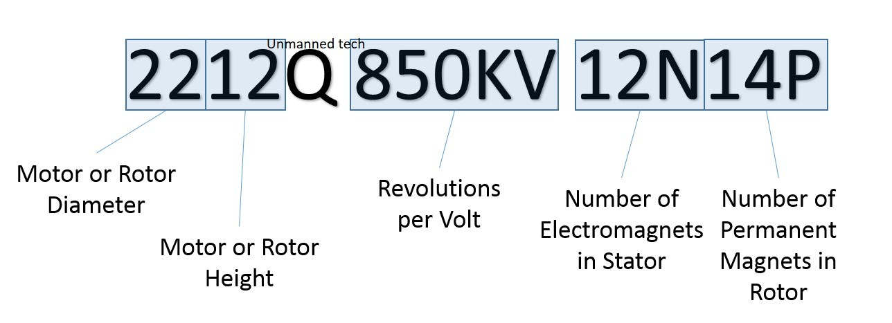

Information about various motors.

# Specifications

Image from [Drone Trest](https://www.dronetrest.com/t/brushless-motors-how-they-work-and-what-the-numbers-mean)

The number of pole pairs is the number of permanent magnets divided by 2.

Ex: for a spec of 14P, the motor had 7 pole pairs.

# Calcs

## ST Motor Profiler

ST motor profiler reports a $K_e$ value in [Vrms/kRPM].

This is related to Kv by:

$K_v = \frac{1000}{K_e * \sqrt2}$

where the 1000 is for the kRPM to RPM conversion in the $K_e$ units.

## General

See [this paper](media/How-to-Model-Brushless-Electric-Motors.pdf) from the Univeristy of Michigan for a detailed description of the complexity of understanding BLDC parameters.  There is also a [YouTube video](https://www.youtube.com/watch?v=jrWDBkeOVQY) that explains the paper.