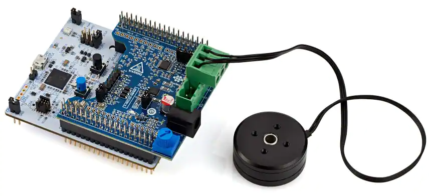

# Source

TBD.  Recived with ST P-NUCLEO-IHM03 development kit.

# Specs

| Spec | Value |
| ---- | --- |
| Part Number | GBM2804H-100T |
| Magnetic Configuration | 12N14P |
| Coil Wire Diameter | 0.19mm |
| Coil Turns | 100 |
| Motor Diameter | 34.8 mm |
| Motor Thickness | 15 mm |
| Shaft Diameter | Hollow 5.0 mm |
| Winding Resistance |10.0 Ω |
| KV | 145 RPM/V |
| Weight | 41.42 gm |

# ST Motor Profiler Test Results

TBD

<!---  --->

# Hand Measured

Phase-phase resistance measured with a DMM was \<TBD\> Ω

<!--- 
> **Note**
>
> Based on hand mesaurement, it looks like ST reports the single phase resistance, while the motor spec lists the phase-phase resistance.
--->